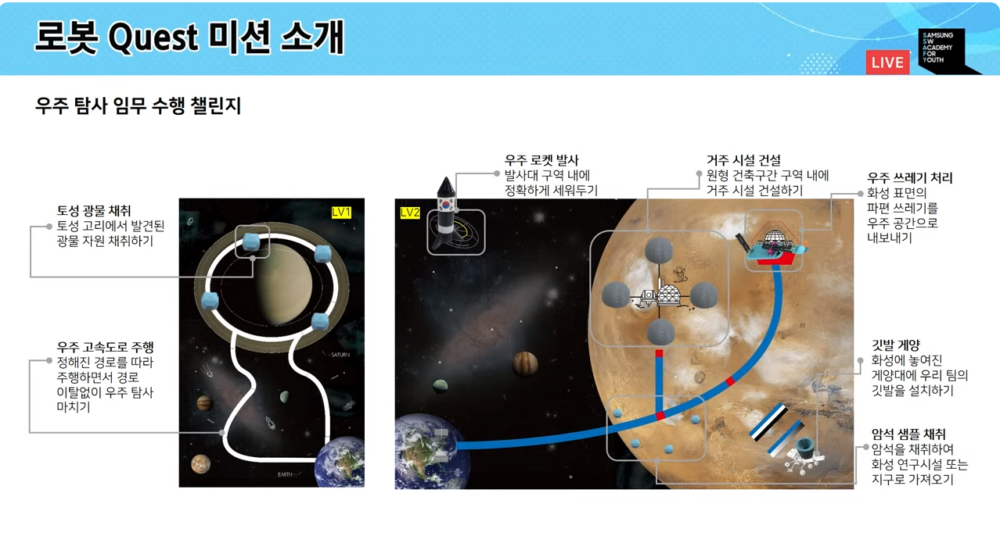
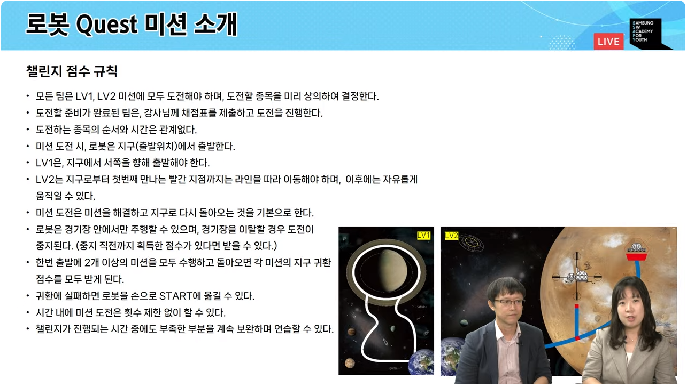
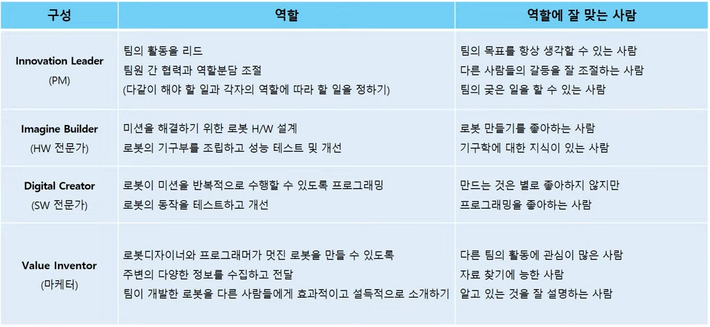

# Robot Quest

<aside>
💡 일시 : 2024-07-08
개발 언어 : Python

</aside>








```python
from hub import light_matrix, sound
import runloop, time

# sound.beep(550, 2000)
# time.sleep_ms(2000)
# light_matrix.write("Hi!")

async def main(): # 비동기 함수
    await light_matrix.write("Hi!") # 비동기 함수 안에서 동시에 작업 가능하게 해줌 await
    time.sleep_ms(1000)
    light_matrix.show_image(light_matrix.IMAGE_HAPPY)
    time.sleep_ms(1000)
    light_matrix.show_image(10)
runloop.run(main())
```

```python
from hub import port
import motor
import runloop, motor_pair
motor_pair.pair (motor_pair. PAIR_1, port. E, port. F)

# async def main():
#     await motor_pair.move_tank_for_degrees (motor_pair.PAIR_1, 205, 300, 300) # 10cm 앞으로 이동

# runloop.run(main())

async def main():
    # motor_pair.move_tank_for_time(motor_pair.PAIR_1, 300, 300, 2000)
    motor_pair.move_for_time(motor_pair.PAIR_1, 2000, 0) # 1초동안 직진 이동
    # await runloop.sleep_ms(2000)
    # motor_pair.stop(motor_pair.PAIR_1)

runloop.run(main())
```

```python
from hub import port
import motor_pair, color_sensor, color, runloop

motor_pair.pair(motor_pair.PAIR_1, port.E, port.F)
async def main():
    while color_sensor.color(port.A) is not color.BLACK :
        if color_sensor.color(port.A) is color.GREEN :
            motor_pair.move_tank(motor_pair.PAIR_1, 300, 150)
        else :
            motor_pair.move_tank(motor_pair.PAIR_1, 150, 300)
    motor_pair.stop(motor_pair.PAIR_1)

runloop.run(main())
# 라인트레이싱
```