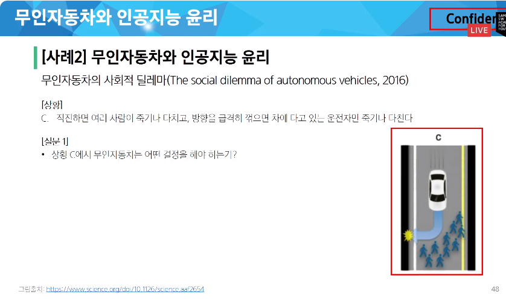
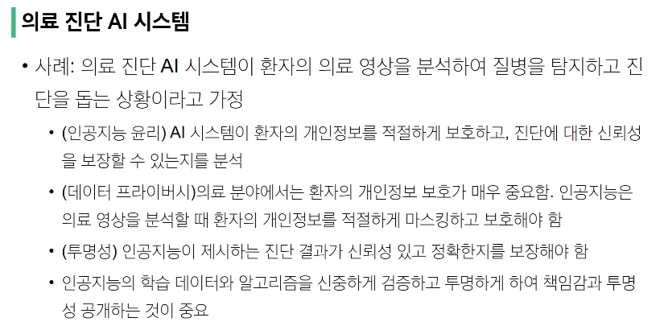
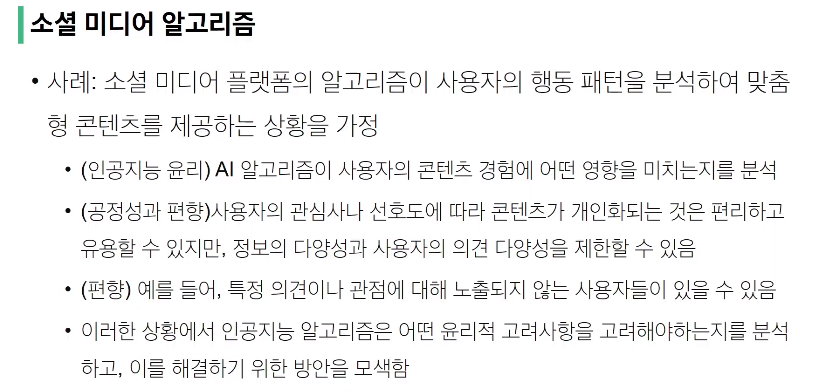
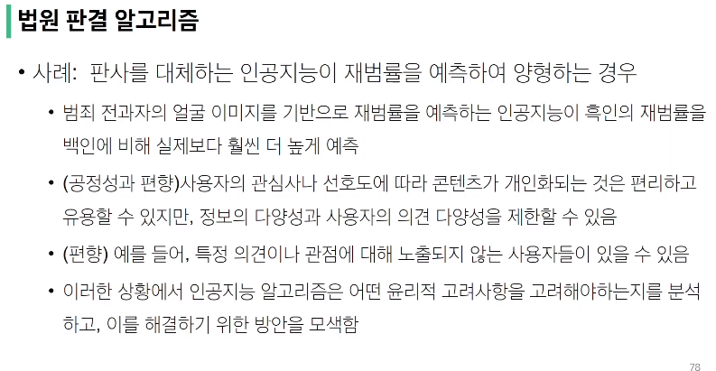
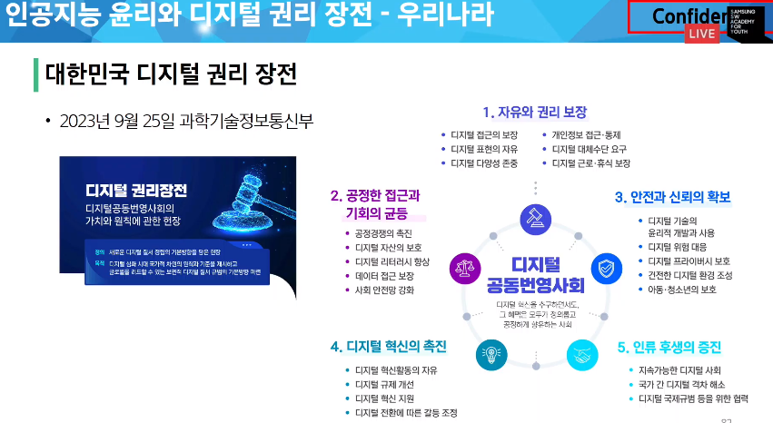

# 인공지능 윤리

2024-07-09 SSAFY start camp

<aside>
💡 인공지능이란? 
Artificial Intelligence: AI
컴퓨터를 사용하여 인간의 지능을 모델링 하는 기술
인간의 지능 활동을 컴퓨터에 접목하는 기술

</aside>

### 다양한 인공지능의 발전 현황

- 현대 사회의 모든 분야에서 연관성을 가지기 시작했다.
- IT 계열 뿐 아니라 영화, 미술, 음악, 문학, 법학, 농업, 광고 등

### 인공지능 활용의 장단점

**장점**

- 인간을 대신하여 편리함을 제공
- 빠르고 올바른 판단에 도움을 줌
- 개인 비서 역할 담당 가능
- 업무의 효율과 생산성을 높임

**단점**

- 인간의 일자리를 잃게 함
- 인공지능에 의해 감시 받거나 종속됨
- 인간 관계가 줄어들 수 있음

### 인공지능 윤리가 필요한 이유

인공지능이 우리 삶의 한 부분으로 급격하게 들어오고 있다. 
사람이 해오던 전통적 의사 결정 행위를 AI 시스템이 대체하면서 사람에게 요구하던 윤리 기준을 AI시스템에게도 요구

### 무인 자동차와 인공지능 윤리

트롤리 딜레마에서 가져온 딜레마

[조사 결과] 76% - 운전자 한 명을 희생해야 한다.

→ 위와 같은 다수의 결정에 따라 자기 희생 모드의 무인 자동차를 제작하는 법률에 찬성하는가?

→ 자기 희생 모드를 장착한 무인 자동차를 구매할 의향이 있는가?

### 인공지능 윤리가 중요한 이유

- 인공지능의 발전은 인류의 삶에 편리성과 안락함을 줄 수도 있지만 삶과 사회를 불안정하게 하고 위협할 수도 있다.
- 인공지능 연구자나 개발자들의 전문가의 역할 수행에 있어 고려해야 할 규칙과 기준이 될 수 있다.
- 인공지능의 의사 결정이 실제로 인간의 가치관과 부합하는지, 인간의 인권과 자유에 어떻게 영향을 미치는지에 대해 예측하고 분석하는 능력이 필요해졌다.

→ 윤리 의식이 없는 인공지능의 위험성

### 인공지능 윤리의 기본 원칙

- **데이터 보호와 프라이버시** 
대규모 데이터 수집, 저장, 처리의 방식이 복잡해지고 확장되면서 프라이버시 침해의 위험이 증가 
→ 합법적이고 윤리적인 정보 수집, 저장 및 활용 방법에 대한 가이드라인 필요
- **공정성(Fairness)과 편향(Bias)** 
AI 시스템은 편견 없이 모든 사용자에게 공정하게 서비스를 제공해야 함
데이터 수집과 모델 학습 과정에서 편향을 최소화해야 함
- **책임성(Accountability)과 투명성(Transparent)** 
AI의 결정 및 행동에 대해 인간 개발자와 운영자는 책임을 져야 함
사용자에게 AI의 결정 과정에 대한 이해와 이의 제기할 수 있는 권리를 보장해야 한다.
- **투명성(Transparency)** 
AI 시스템의 작동 원리와 결정 기준은 명확하고 이해하기 쉽게 공개되어야 한다. 
사용자가 AI의 결정 과정을 이해하고, 필요한 경우 검토하거나 문제를 제기할 수 있도록 지원해야 함
데이터 처리 및 활용 방식에 대해 사용자에게 충분한 정보를 제공하고, 필요한 동의를 얻는 절차를 확립해야 한다.

### 인공지능 윤리 사례 분석

### 인공지능 윤리와 디지털 권리 장전

> 제 4장 안전하고 신뢰할 수 있는 디지털 사회
제 17조 (디지털 기술의 윤리적 개발과 사용) 디지털 기술의 개발과 사용은 안전과 신뢰를 확보할 수 있도록 윤리적인 방식으로 책임 있게 이루어져야 한다.
> 

### EU 인공지능 법안(EU AI Act)

### 설명할 수 있는 AI(Explainable AI)

1. 측정형 기술
AI 윤리 준수 여부를 정량적으로 평가
각 기업이 부담할 수 있는 AI 리스크를 시스템으로 최소화
2. 설명 가능한 AI
AI 모델의 복잡한 블랙박스를 투명하게 보여줌

### 기업별 인공지능 윤리 선언

구글, 아마존, 삼성, 카카오, KT에서 가이드라인을 제정하고 인공지능 윤리 담당 부서 배치

# $AI 리터러시(Literacy)를 키우자!$

- ai가 동작하는 원리를 이해하고, 결과를 해석하며, ai 시스템과 효과적으로 상호작용하는 능력을 키우자
- 책임감 있는 마음을 가지고 AI가 미칠 수 있는 윤리적, 사회적 영향력을 잘 이해하는 능력을 키우자