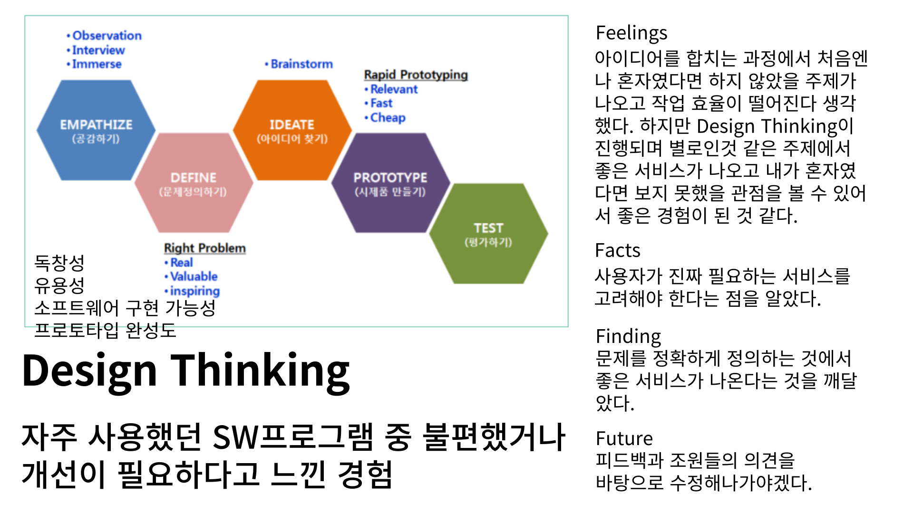
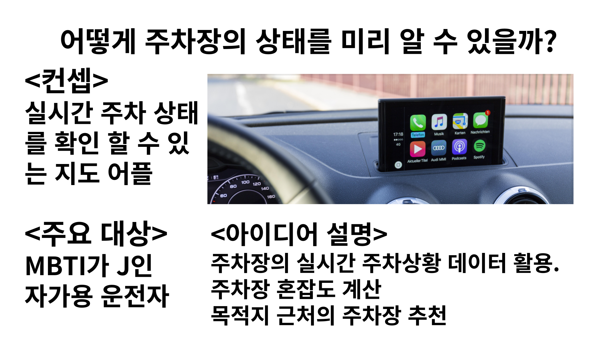
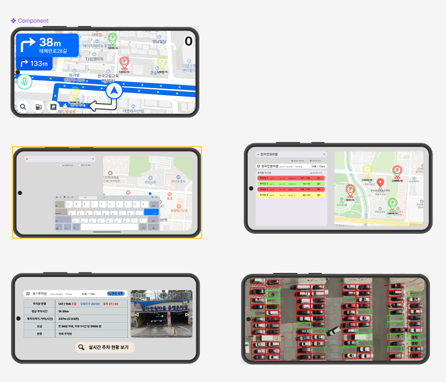
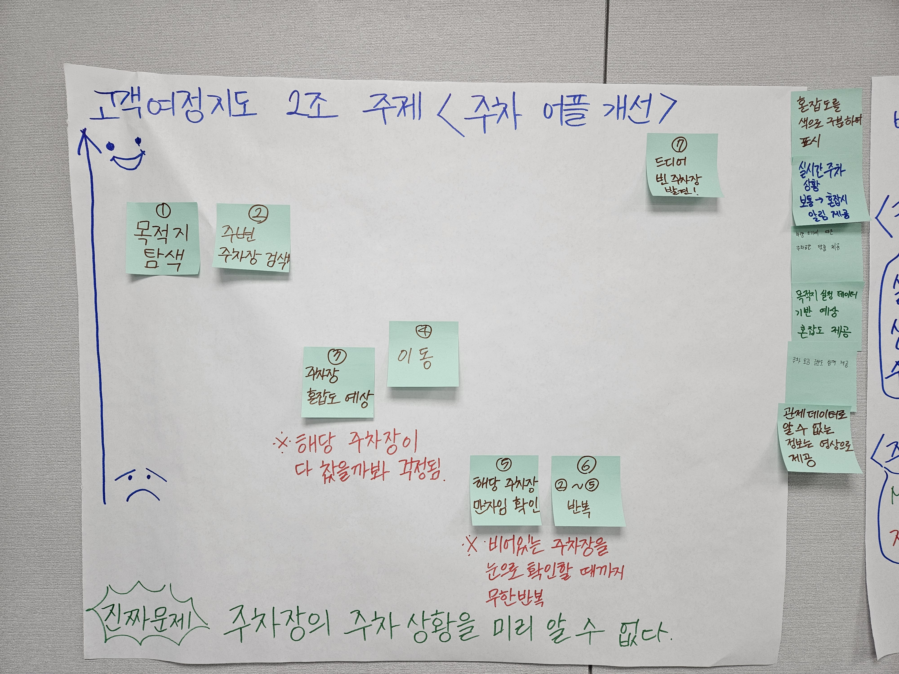
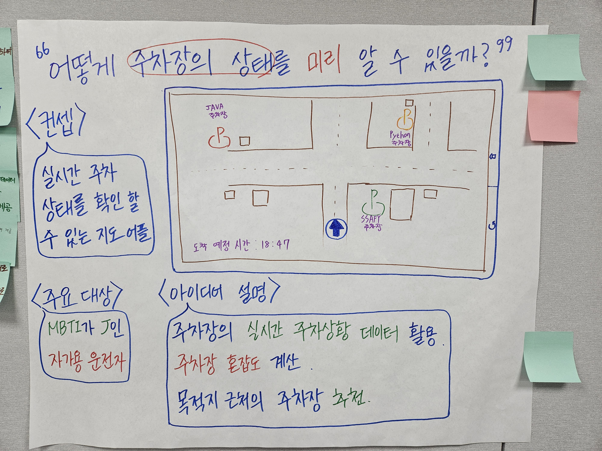

# Design Thinking

## 1일차 - Design Thinking

## 내 원동력이 되어줄 슬로건

## Design Thinking - 2조 실시간 주차 자리 확인을 위한 지도 개선

## 2일차 - pivot, 목업 만들기 / 아이디어톤 경진대회

- pivot
빠른 전략적 변화
- 목업
제품 디자인 평가를 위해 만들어지는 와이어 프레임과 같은 것

Figma

[https://www.figma.com/design/E2AbVrX93iEhMYHlcBHfWl/SSAFY?node-id=0-1&t=fzx2tfV2cjxwLwRd-0](https://www.figma.com/design/E2AbVrX93iEhMYHlcBHfWl/SSAFY?node-id=0-1&t=fzx2tfV2cjxwLwRd-0)

### 평가

독창성 / 유용성 / 소프트웨어 구현 가능성 / 프로토타입 완성도

1조 : 20 / 25 / 23 / 25 → 93 (노트북 추천 채팅 봇)

3조 : 20 / 15 / 20 / 25 → 80 (분리수거 가이드 시스템)

4조 : 20 / 20 / 20 / 25 → 85 (대중교통 혼잡도 미리 알기)

5조 : 20 / 25 / 15 / 25 → 85 (대중교통 실시간 최단 경로 찾기)

<aside>
💡 2조 피드백 :  
준비된 사진은 항공 샷 이라서 숫자를 셀 수 있지만 저 위치에 카메라가 없으면 어쩌나? 
→ 저 각도의 화면이 아니더라도 기존 cctv에 학습 모델을 돌려 주차 현황을 파악한다. 
주차장 아이콘이 너무 복잡하지 않을까? 
→ 목적지 근처에 도착했을 때만 아이콘이 표기되도록 변경하겠습니다..! 
대기업도 못한 걸 신생 스타트업이 이 데이터를 어떻게 확보할 것인가? 
→ 배민의 시작과 같다. 이 서비스를 이용하는 주차장이 오히려 경쟁력이 생길 것이고 또는 기존 지도 어플에 삽입하게 될 수 도 있기에 그 부분은 걱정하지 않는다.

</aside>

### 4F

- Feelings

**활동을 하면서 든 감정** 
훌륭한 팀원들과 가볍지만 집중해서 협업을 진행하니 빠르게 친해질 수 있어 좋았다. 또한 이곳에 있는 모두가 굉장히 똑똑하다고 느껴질 정도로 다들 발표도 잘하고, 배워갈 점도 너무 많아서 신선한 자극이 됐다.

- Facts

**활동을 통해 알게 된 사실** 
어제는 사용자의 관점에서 문제를 정의하고 아이디어까지 도출하는 법을 배웠다면 오늘은 그런 관점에서 사용자가 진짜 원하는 기능에 집중한 서비스를 만드는 법을 알았다.

- Findings

**활동을 통해 깨달은 것 / 느낀 점** 
morkup과 pivot전략을 배웠고 직접 실천해보고 배웠다. 사용자가 진짜 필요로 하는 서비스를 만들어야 한다는 것을 깨달았다.

- Future

**이후 적용 방안** 
이후 이어질 프로젝트에서도 주제 선정부터 이렇게 접근해 나가야겠다고 느꼈기에 이 방식을 적용해서 많은 사람이 필요로 하는 서비스를 만들겠다.
또한, 발표를 보니, 내가 써보고 싶은 기능을 만든 팀은 좋은 점수를 받은 것 같다. 다음 프로젝트에서는 우선 사용자가 써보고 싶은 기능인가를 먼저 고려 해봐야겠다.

