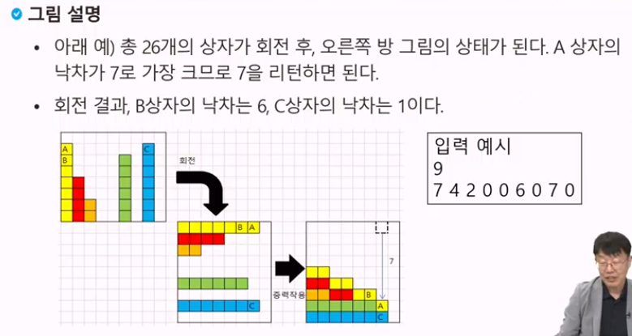
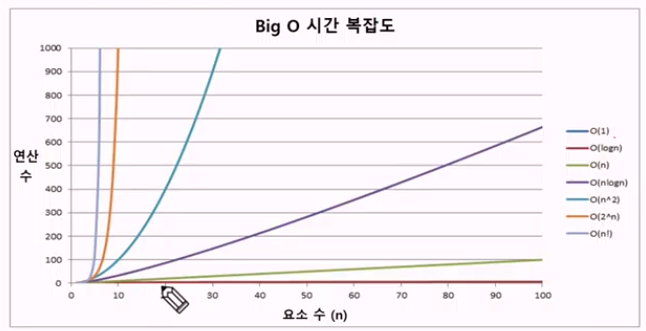

# 배열 1

### APS(Algorithm Problem Solving) 기본 학습

- 입출력을 제외한 내장 함수 사용하지 않기.
- 기본적인 내장 함수의 동작 원리 이해.

---

### 알고리즘

유한한 단계를 통해 문제를 해결하기 위한 절차나 방법이다.
주로 컴퓨터 용어로 쓰이며, 컴퓨터가 어떤 일을 수행하기 위한 단계적 방법을 말한다.

- 알고리즘을 표현하는 방법 2가지
    - 의사코드(슈도코드, Pseudocode)
    - 순서도
- 무엇이 좋은 알고리즘인가?
    1. 정확성 : 얼마나 정확하게 동작하는가
    2. 작업량 : 얼마나 적은 연산으로 원하는 결과를 얻어내는가
    3. 메모리 사용량 : 얼마나 적은 메모리를 사용하는가
    4. 단순성 : 얼마나 단순한가
    5. 최적성 : 더 이상 개선할 여지없이 최적화되었는가
- 알고리즘의 작업량을 표현할 때 시간복잡도로 표현한다.
    - 실제 걸리는 시간을 측정
    - 실행되는 명령문의 개수를 계산
    
    ### 빅-오 표기법(Big-O Notation)
    
    - 빅-오 표기법(Big-O Notation)
    - 시간 복잡도 함수 중에서 가장 큰 영향력을 주는 n에 대한 항만을 표시
    - 계수(Coefficient)는 생략하여 표시
        
        $$
        O(3n + 2) = O(3n) = O(n)
        $$
        
    - 요소 수가 증가함에 따라 각기 다른 시간복잡도의 알고리즘은 아래와 같은 연산 수를 보인다.
        
        
        

---

## 배열

- 일정한 자료형의 변수들을 하나의 이름으로 열거하여 사용하는 자료구조
- 3개의 변수를 사용해야 하는 경우, 이를 배열로 바꾸어 사용하는 예.
    
    num0 = 0; / num1 = 1; / num2 = 2 → num = [0,1,2]
    
    <aside>
    💡 단순히 다수의 변수 선언을 의미하는 것이 아니라, 다수의 변수로는 하기 힘든 작업을 배열을 활용해 쉽게 할 수 있다.
    
    </aside>
    
    ### 1차원 배열의 선언
    
    - 별도의 선언 방법이 없으면 변수에 처음 값을 할당할 때 생성
    - 이름 : 프로그램에서 사용할 배열의 이름 <br>
    `Arr = list()`, `Arr = [0]*10`  → 1차원 배열 선언의 예
    
    ### 1차원 배열의 접근
    
    - Arr[0] = 10 # ‘배열 Arr의 0번 원소에 10을 저장하라’
    - Arr[idx] = 20 # ‘배열 Arr의 idx번 원소에 20을 저장하라’
    - 입력받은 정수를 1차원 배열에 저장하는 방법<br>
    ex) 첫 줄에 양수의 개수 N이 주어진다. (5 ≤ N ≤ 1000)<br>
    다음 줄에 빈칸으로 구분된 N개의 양수 Ai가 주어진다. (1 ≤ Ai ≤ 1000000)
        
        ```python
        N = int(input())
        arr = list(map(int, input().split()))
        ```
        
    
    ### 배열 활용 예제 : Gravitiy
    
    - 상자들이 쌓여있는 방이 있다. 방이 오른쪽으로 90도 회전하여 상자들이 중력의 영향을 받아 낙하한다고 할 때, 낙차가 가장 큰 상자를 구하여 그 낙차를 리턴하는 프로그램을 작성하시오.
    - 중력은 회전이 완료된 후 적용한다.
    - 상자들은 모두 한쪽 벽면에 붙여진 상태로 쌓여 2차원의 형태를 이루며 벽에서 떨어져서 쌓인 상자는 없다.
    - 상자의 가로, 세로 길이는 각각 1이다.
    - 방의 가로길이는 100이며, 세로 길이도 항상 100이다.
    - 즉, 상자는 최소 0, 최대 100 높이로 쌓을 수 있다
    - 상자가 놓인 가로 칸수의 N, 다음 줄에 각 칸의 상자 높이가 주어진다.
        
        
        

## 정렬

- 2개 이상의 자료를 특정 기준에 의해 작은 값부터 큰 값(오름차순 : ascending), 혹은 그 반대의 순서대로(내림차순 : descending) 재배열 하는 것
- 키
    - 자료를 정렬하는 기준이 되는 특정 값
- 정렬 방식의 종류
    - 버블 정렬 (Bubble Sort)
    - 카운팅 정렬 (Counting Sort)
    - 선택 정렬 (Selection Sort)
    - 퀵 정렬 (Quick Sort)
    - 삽입 정렬 (Insertion Sort)
    - 병합 정렬 (Merge Sort)
    
    ### 버블 정렬 (Bubble Sort)
    
    인접한 두 개의 원소를 비교하며 자리를 계속 교환하는 방식
    
    - 정렬 과정
        - 첫 번째 원소부터 인접한 원소끼리 계속 자리를 교환하면서 맨 마지막 자리까지 이동한다.
        - 한 단계가 끝나면 가장 큰 원소가 마지막 자리로 정렬된다.
        - 교환하며 자리를 이동하는 모습이 물 위에 올라오는 거품 모양과 같다고 하여 버블 정렬이라고 한다.
    - 시간 복잡도
        
        $$
        O(n^2)
        $$
        
        ```python
        BubbleSort(a, N):     # 정렬할 배열과 배열의 크기
        for i : N-1 -> 1      # 정렬할 구간의 끝
        	for j : 0 -> i-1    # 비교할 원소 중 왼쪽 원소의 인덱스
        		if a[j] > a[j+1]  # 왼쪽 원소가 더 크면
        			a[j] <-> a[j+1] # 오른쪽 원소와 교환
        ```
        
        ```python
        def BubbleSort(a, N): # 오름차순
        	for i in range(N-1, 0, -1):
        		for j in range(0, i):
        			if a[j] > a[j+1]:
        				a[j], a[j+1] = a[j+1], a[j]
        ```