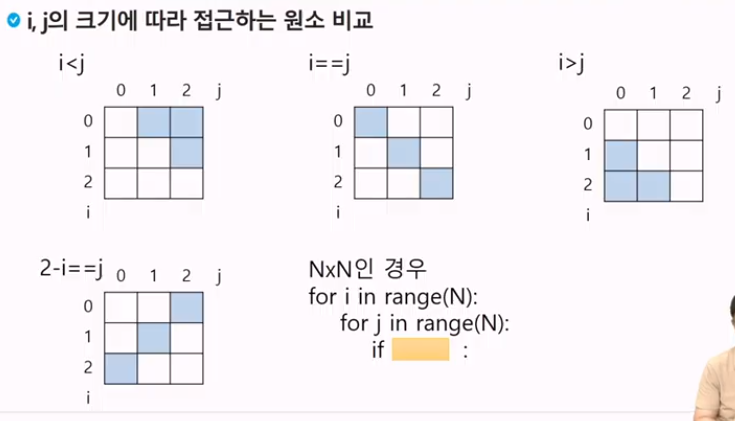

# 배열 3

## 2차원 배열

### 선언

- 1차원 List를 묶어놓은 List
- 2차원 이상의 다차원 List는 차원에 따라 Index를 선언
- 2차원 List의 선언 : 세로길이(행의 개수), 가로길이(열의 개수)를 필요로 함
- Python에서는 데이터 초기화를 통해 변수선언과 초기화가 가능함

`arr = [[0,1,2,3],[4,5,6,7]]` 

(2행 4열의 2차원 List)

3<br>
1 2 3<br>
4 5 6<br>
7 8 9

3<br>
123<br>
456<br>
789

| 0 | 1 | 2 | 3 |
| --- | --- | --- | --- |
| 4 | 5 | 6 | 7 |

```python
N = int(input)
arr = [list(map(int, input().split())) for _ in range(N)]
```

```python
N = int(input)
arr = [list(map(int, input())) for _ in range(N)]
```

---

### 배열 순회

n X m 배열의 n*m개의 모든 원소를 빠짐없이 조사하는 방법

### 행 우선 순회

```python
# i 행의 좌표
# j 열의 좌표
for i in range(n):
	for j in range(m):
		f(array[i][j]) # 필요한 연산 수행
```

### 열 우선 순회

```python
# i 행의 좌표
# j 열의 좌표
for j in range(m):
	for i in range(n):
		f(array[i][j]) # 필요한 연산 수행
```

### 지그재그 순회

```python
# i 행의 좌표
# j 열의 좌표
for i in range(n):
	for j in range(m):
		f(array[i][j + (m-1-2*j) * (i%2)]) # 필요한 연산 수행
```

### 델타를 이용한 2차 배열 탐색

- 2차 배열의 한 좌표에서 4방향의 인접 배열 요소를 탐색하는 방법
- 인덱스 (i, j)인 칸의 상하좌우 칸 (ni, nj)

|  |  |  |
| --- | --- | --- |
| i+0, j-1 ← | (i, j) | → i+0, j+1 |
|  |  |  |

di[] ← [0, 1, 0, -1] # 방향별로 더 할 값<br>
dj[] ← [1, 0, -1, 0]

for k : 0 → 3
    ni ← i + di[k]
    nj ← j + dj[k]

```python
arr[0...N-1][0...N-1] # NxN 배열
di = [0, 1, 0, -1]
dj = [1, 0, -1, 0]
for i : 0 -> N-1
	for j : 0 -> N-1:
		for k in range(4):
			ni <- i + di[k]
			nj <- j + dj[k]
			if 0 <= ni < N and 0 <= nj < N # 유효한 인덱스면
				f(arr[ni][nj])
```

### 전치 행렬

```python
# i : 행의 좌표, len(arr)
# j : 열의 좌표, len(arr[0])
arr = [[1,2,3],[4,5,6],[7,8,9]] # 3*3 행렬

for i in range(3):
	for j in range(3):
		if i < j:
			arr[i][j], arr[j][i] = arr[j][i], arr[i][j]
```



### 연습문제

5x5 2차 배열에 25개의 숫자를 저장하고, 25개의 각 요소에 대해서 그 요소와 이웃한 요소와의 차의 절대값을 구하시오.<br>
예를 들어 표에서  7값의 이웃한 값은 2, 6, 8, 12 이며 차의 절대값의 합은 12이다.<br>
25 개의 요소에 대해서 모두 조사하여 총합을 구하시오.<br>
벽에 있는 요소는 이웃한 요소가 없을 수 있음을 주의하시오.<br>

|  | 2 |  |
| --- | --- | --- |
| 6 | 7 | 8 |
|  | 12 |  |

|2-7| + |6-7| + |8-7| + |12-7| =12

```python
N = int(input())
arr = [list(map(int, input().split())) for _ in range(N)]

di = [0, 1, 0, -1]
dj = [1, 0, -1, 0]

total = 0
for i in range(N):
	for j in range(N): # NxN 배열의 모든 원소에 대해
		s = 0 # 문제에서 원소와 인접원소의 차의 ... 합 저장
		# i, j 원소의 4방향 원소에 대해
		for k in range(4):
			ni = i + di[k]
			nj = j + dj[k]
			if 0<=ni<N and 0<=nj<N:
				s += abs(arr[i][j] - arr[ni][nj])   # 실존하는 인접원소 ni, nj
		total += s
print(total)
```

### 부분집합 합 문제(Subset Sum) 문제

유한 개의 정수로 이루어진 집합이 있을 때, 이 집합의 부분집합 중에서 그 집합의 원소를 모두 더한 값이 0이 되는 경우가 있는지를 알아내는 문제

예를 들어, [-7,-3, -2, 5, 8]라는 집합이 있을 때, [-3, -2, 5]는 이 집합의 부분집합이면서 (-3)+(-2)+5=0이므로 이 경우의 답은 참이 된다.

완전검색 기법으로 부분집합 합 문제를 풀기 위해서는, 우선 집합의 모든 부분집합을 생성한 후에 각 부분집합의 합을 계산해야 한다.

### 부분 집합의 수

- 집합의 원소가 n개일 때, 공집합을 포함한 부분집합의 수는 2**n개 이다.
- 이는 각 원소를 부분집합에 포함시키거나 포함시키지 않는 2가지 경우를 모든 원소에 적용한 경우의 수와 같다.
- 각 원소가 부분집합에 포함되었는지를 loop 이용하여 확인하고 부분집합을 생성하는 방법

```python
bit = [0, 0, 0, 0]
for i in range(2):
	bit[0] = i # 0번 원소
	for j in range(2):
		bit[1] = j # 1번 원소
		for k in range(2):
			bit[2] = k # 2번 원소
			for I in range(2):
				bit[3] = I # 3번 원소
				print_subset(bit) # 생성된 부분집합 출력
```

### 비트 연산자

| & | 비트 단위로 AND 연산을 한다. |
| --- | --- |
| | | 비트 단위로 OR 연산을 한다. |
| << | 피연산자의 비트 열을 왼쪽으로 이동시킨다. |
| >> | 피연산자의 비트 열을 오른쪽으로 이동시킨다. |
- << 연산자
1<<n : 2**n 즉, 원소가 n개일 경우의 모든 부분집합의 수를 의미한다.
- & 연산자
i & (1<<j) : i의 j번째 비트가 1인지 아닌지를 검사한다.
    
    ### 보다 간결하게 부분집합을 생성하는 방법
    
    ```python
    arr = [3, 6, 7, 1, 5, 4]
    
    n = len(arr) # n : 원소의 개수
    
    for i in range(1<<n): # 1<<n : 부분 집합의 개수
    	for j in range(n): # 원소의 수만큼 비트를 비교함
    		if i & (1<<j): # i의 j번 비트가 1인 경우
    			print(arr[j], end=", ") # j번 원소 출력
    		print()
    	print()
    ```