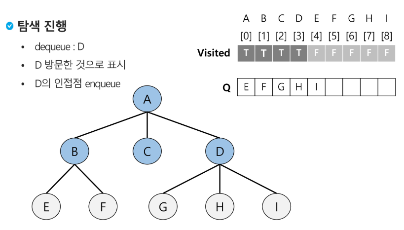

# Queue 2

## BFS(Breadth First Search)

- 그래프를 탐색하는 방법에는 크게 두 가지가 있음
    - 깊이 우선 탐색(Depth First Search, DFS)
    - 너비 우선 탐색(Breadth First Search, BFS)
- 너비우선탐색 과정
    1. 탐색 시작점의 인접한 정점들을 먼저 모두 차례로 방문한 후에, 
    2. 방문했던 정점을 시작점으로 하여 다시 인접한 정점들을 차례로 방문하는 방식
- 인접한 정점들에 대해 탐색을 한 후, 차례로 다시 너비우선탐색을 진행해야 하므로, 선입선출 형태의 자료 구조인 큐를 활용함
- 입력 파라미터 : 그래프 G와 탐색 시작점 v
    
    ```python
    def BFS(G, v): # 그래프 G, 탐색 시작점 v
    	visited = [0]*(n+1)        # visitied 배열 초기화 / n : 정점의 개수
    	queue = []                 # 큐 생성
    	queue.append(v)            # 시작점 v를 큐에 삽입
    	while queue:               # 큐가 비어있지 않은 경우
    		t = queue.pop(0)         # 큐의 첫번째 원소 반환 -> 방문할 노드 or 처리할 노드
    		if not visited[t]:       # 방문되지 않은 곳이라면
    			visited[t] = True      # 방문할 것으로 표시
    			visit(t)               # 정점 t에서 할 일
    			for i in G[t]:         # t와 연결된 모든 정점에 대해
    				if not visited[i]:   # 방문되지 않은 곳이라면
    					queue.append(i)    # 큐에 넣기
    ```
    
    - 초기 상태
        - visited 배열 초기화
        - queue 생성 `Q = []`
        - 시작점 enqueue `Q.append(v)`
    - A점부터 시작
        - dequeue : A
        - A 방문한 것으로 표시
        - A의 인접점 enqueue
    - 탐색 진행
        - dequeue : B
        - B 방문한 것으로 표시
        - B의 인접점 enqueue
    - 탐색 진행
        - dequeue : C
        - C 방문한 것으로 표시
        - C의 인접점 enqueue
    
    
    
- 입력 파라미터 : 그래프 G와 탐색 시작점 v
    
    ```python
    def BFS(G, v, n): # 그래프 G, 탐색 시작점 v
    	visited = [0]*(n+1)                 # n: 정점의 개수
    	queue = []                          # 큐 생성
    	queue.append(v)                     # 시작점 v를 큐에 삽입
    	visited[v] = 1
    	while queue:                        # 큐가 비어있지 않은 경우
    		t = queue.pop(0)                  # 큐의 첫번째 원소 반환
    		visit(t)
    		for i in G[t]:                    # t와 연결된 모든 정점에 대해
    			if not visited[i]:              # 방문되지 않은 곳이라면
    				queue.append(i)               # 큐에 넣기
    				visited[i] = visited[t] + 1   # n으로 부터 1만큼 이동
    ```
    
    enqueue를 기준으로 visited를 체크
    

### 연습 문제

- 다음은 연결되어 있는 두 개의 정점 사이의 간선을 순서대로 나열 해 놓은 것이다. 모든 정점을 너비우선탐색 하여 경로를 출력하시오. 시작 정점을 1로 시작하시오.
    - 1, 2, 1, 3, 2, 4, 2, 5, 4, 6, 5, 6, 6, 7, 3, 7
    - 출력 결과의 예는 다음과 같다.
        
        1-2-3-4-5-7-6
        
        ```python
        '''
        7 8
        1 2 1 3 2 4 2 5 4 6 5 6 6 7 3 7
        '''
        def bfs(s, V):  # 시작점 s, 마지막 정점 V
            # 준비
            visited = [0]*(V+1)    # visited 생성
            q = []                 # 큐 생성
            q.append(s)            # 시작점 인큐
            visited[s] = 1         # 시작점 방문 표시
        
            # 탐색
            while q:               # 탐색할 정점이 남아있으면
                t = q.pop(0)       # t<-디큐
                print(t)           # 처리
                for w in adj_l[t]:    # t에 인접이고, 인큐된적이 없으면
                    if visited[w]==0:
                        q.append(w) # 인큐하고 인큐됨 표시
                        visited[w] = 1
        
        V, E = map(int, input().split())    # V: 마지막 정점 번호, E: 간선 수
        arr = list(map(int, input().split()))
        adj_l = [[] for _ in range(V+1)]    # 인접 리스트
        for i in range(E):
            v1, v2 = arr[i*2], arr[i*2+1]
            adj_l[v1].append(v2)
            adj_l[v2].append(v1)            # 방향이 없을 때
        
        bfs(1, V)                           # 출발점, 정점수
        ```