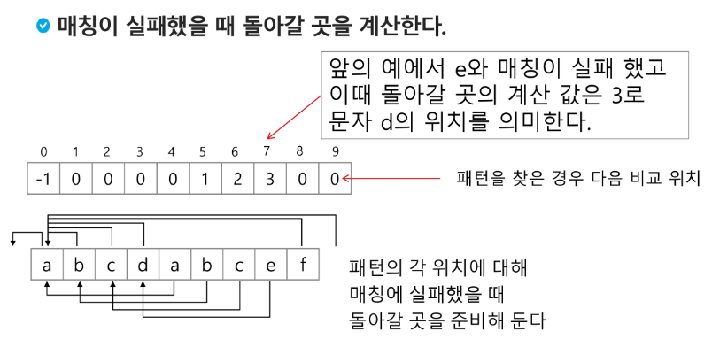
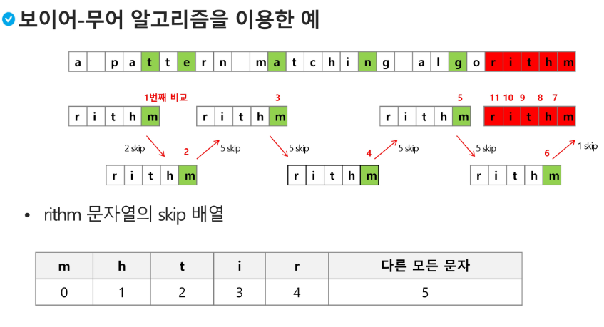
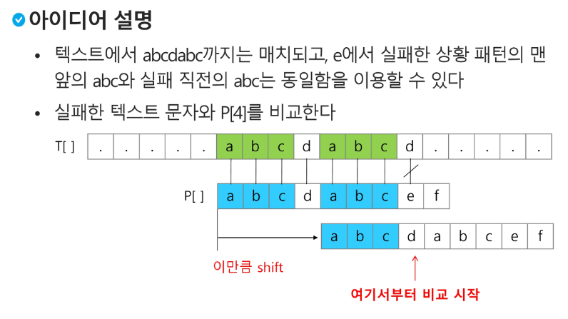

# 문자열(String)

### 패턴 매칭에 사용되는 알고리즘들

- 고지식한 패턴 검색 알고리즘
- 카프-라빈 알고리즘
- KMP 알고리즘
- 보이어-무어 알고리즘

## 고지식한 알고리즘(Brute Force)

- 본문 문자열을 처음부터 끝까지 차례대로 순회하면서 패턴 내의 문자들을 일일이 비교하는 방식으로 동작

```python
p = 'is' # 찾을 패턴
t = 'This is a book~!' # 전체 텍스트
M = len(p) # 찾을 패턴의 길이
N = len(t) # 전체 텍스트의 길이

def BruteForce(p, t):
	i = 0 # t의 인덱스
	j = 0 # p의 인덱스
	while j<M and i<N:
		if t[i] != p[j]:
			i = i-1
			j = -1
		i = i+1
		j = j+1
	if j == M:
		return i - M
	else:
		return -1
```

```python
t = 'TTTTTABC'
p = 'TTA'
N = len(t)
M = len(p)
for i in range(N-M+1): # 비교 시작위치
    for j in range(M):
        if t[i+j] != p[j]:
            break # for j, 다음 글자부터 비교 시작
        else:       # for j가 중단없이 반복되면
            cnt += 1    # 패턴 개수 증가
print(cnt)
```

### 고지식한 패턴 검색 알고리즘의 시간 복잡도

- 최악의 경우 시간 복잡도는 텍스트의 모든 위치에서 패턴을 비교해야 하므로 O(MIN)이 됨
- 길이가 10000인 문자열에서 길이 80인 패턴을 찾는다고 할 때, 최악의 경우 약 10,000*80 = 800,000 번의 비교가 일어난다.
- 비교 횟수를 줄일 수 있는 방법은 없는가?

## KMP 알고리즘

- 불일치가 발생한 텍스트 스트링의 앞 부분에 어떤 문자가 있는지를 미리 알고 있으므로, 불일치가 발생한 앞 부분에 대하여 다시 비교하지 않고 매칭을 수행
- 패턴을 전처리하여 배열 next[M]을 구해서 잘못된 시작을 최소화함
    - next[M] : 불일치가 발생했을 경우 이동할 다음 위치
- 시간 복잡도 : O(M+N)

### 아이디어 설명

- 텍스트에서 abcdabc까지는 매치되고, e에서 실패한 상황 패턴의 맨 앞의 abc와 실패 직전의 abc는 동일함을 이용할 수 있다
- 실패한 텍스트 문자와 P[4]를 비교한다.





```python
def kmp(t, p):
    N = len(t)
    M = len(p)
    lps = [0] * (M+1)
    # preprocessing
    j = 0 # 일치한 개수 == 비교할 패턴 위치
    lps[0] = -1
    for i in range(1,M):
        lps[i] = j
        if p[i] == p[j]:
            j += 1
        else:
            j = 0
    lps[M] = j
    # search
    i = 0
    j = 0
    while i < N and j <= M:
        if j==-1 or t[i] == p[j]: # 첫 글자가 불일치했거나, 일치하면
            i += 1
            j += 1
        else:                     # 불일치
            j = lps[j]
        if j==M:                  # 패턴을 찾을 경우
            print(i-M, end = ' ') # 패턴의 인덱스 출력
            j = lps[j]
    print()
    return

```

## 보이어-무어 알고리즘

- 오른쪽에서 왼쪽으로 비교
- 대부분의 상용 소프트웨어에서 채택하고 있는 알고리즘
- 보이어-무어 알고리즘은 패턴에 오른쪽 끝에 있는 문자가 불일치 하고 이 문자가 패턴 내에 존재하지 않는 경우, 이동 거리는 무려 패턴의 길이 만큼이 된다.
- 오른쪽 끝에 있는 문자가 불일치하고 이 문자가 패턴 내에 존재하는 경우에는 그 글자끼리 매칭 시켜주고 다시 비교



## 문자열 매칭 알고리즘 비교

- 찾고자 하는 문자열 패턴의 길이 m, 총 문자열 길이 n
- 고지식한 패턴 검색 알고리즘 : 수행 시간 O(mn)
- 카프-라빈 알고리즘 : 수행 시간 θ(n)
- KMP 알고리즘 : 수행 시간 θ(n)
- 보이어-무어 알고리즘
    - 앞의 두 매칭 알고리즘들의 공통점은 텍스트 문자열의 문자를 적어도 한번씩 훑는다는 것이다. 따라서 최선의 경우에도 Ω(n)
    - 보이어-무어 알고리즘은 텍스트 문자를 다 보지 않아도 된다.
    - 발상의 전환 : 패턴의 오른쪽부터 비교한다.
    - 최악의 경우 수행 시간 : θ(mn)
    - 입력에 따라 다르지만 일반적으로 θ(n)보다 시간이 덜 든다.

---

## 연습 문제

### 1989. 초심자의 회문검사

- “level”과 같이 거꾸로 읽어도 제대로 읽은 것과 같은 문장이나 낱말을 회문이라 한다.
- 단어를 입력 받아 회문이면 1을 출력하고, 아니라면 0을 출력하는 프로그램을 작성하라.

<aside>
💡 3
level         #1 1
samsung  #2 0
eye           #3 1

</aside>

```python
T = int(input())
for tc in range(1, T+1):
    s = input()
    N = len(s)
    ans = 1
    for i in range(N//2):
        if s[i] != s[N-1-i]:
            ans = 0
            break
    print(f'#{tc} {ans}')
```

### 회문

ABBA처럼 어느 방향에서 읽어도 같은 문자열을 회문이라 한다. <br>NxN 크기의 글자판에서 길이가 M인 회문을 찾아 출력하는 프로그램을 만드시오. <br>회문은 1개가 존재하는데, 가로 뿐만 아니라 세로로 찾아질 수도 있다.