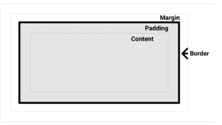

# CSS

Cascading Style Sheet
웹 페이지의 디자인과 레이아웃을 구성하는 언어

### CSS 구문

```html
h1 {                   # 선택자
	color: red;          # 선언
	font-size: 30px;     # 속성(Property) : 값(Value)
}
```

- 하나의 구문이 끝나고 내려갈 때 `;` 꼭 붙이기 (문장의 종료)
- 들여쓰기는 html과 마찬가지로 의미 없다.

### 인라인(Inline) 스타일

- HTML 요소 안에 style 속성 값으로 작성

```html
<body>
	<h1 style="color: blue, background-color: yellow;">Hello World!</h1>
</body>
```

- 권장하지 않음

### 내부(Internal) 스타일 시트

- head 태그 안에 style 태그에 작성

```html
<head>
  <meta charset="UTF-8">
  <meta name="viewport" content="width=device-width, initial-scale=1.0">
  <title>Document</title>
  <style>
    h2 {
      color: red;
    }
  </style>
</head>

<body>
  <h2>Internal Style</h2>
</body>
```

### 외부(External) 스타일 시트

- 별도 CSS 파일 생성 후 HTML link 태그를 사용해 불러오기

```html
<head>
  <meta charset="UTF-8">
  <meta name="viewport" content="width=device-width, initial-scale=1.0">
  <link rel="stylesheet" href="style.css">
  <title>Document</title>
</head>

<body>
  <h3>External Style</h3>
</body>
```

---

### CSS Selectors(선택자) 종류

- 기본 선택자
    - 전체(*) 선택자
    - 요소(tag) 선택자
    - 클래스(class) 선택자 (’.’ (dot))
        - 주어진 클래스 속성을 가진 모든 요소를 선택
    - 아이디(id) 선택자 (’#’)
        - 주어진 아이디 속성을 가진 요소 선택
        - 문서에는 주어진 아이디를 가진 요소가 하나만 있어야 함
    - 속성(attr) 선택자 등
- 결합자 (Combinators)
    - 자손 결합자 (” “ (space) )
        - 첫 번째 요소의 자손 요소들 선택
        - 예) p span은 <p> 안에 있는 모든 <span>를 선택 (하위 레벨 상관 없이)
    - 자식 결합자 (”>”)
        - 첫 번째 요소의 직계 자식만 선택
        - 예) ul > li은 <ul> 안에 있는 모든 <li>를 선택 (한단계 아래 자식들만)
- 코드
    
    ```html
    <!DOCTYPE html>
    <html lang="en">
    
    <head>
      <meta charset="UTF-8">
      <meta name="viewport" content="width=device-width, initial-scale=1.0">
      <title>Document</title>
      <style>
        * {
          color: red;
        }
    
        h2 {
          color: orange;
        }
    
        h3,
        h4 {
          color: blue;
        }
    
        /* 클래스 선택자 */
        .green {
          color: green;
        }
        /* 아이디 선택자 */
        #purple {
          color: purple;
        }
    
        /* 자식 결합자 */
        .green > span {
          font-size: 50px;
        }
        .green li {
          color: brown;
        }
      </style>
    </head>
    
    <body>
      <h1 class="green">Heading</h1>
      <h2>선택자</h2>
      <h3>연습</h3>
      <h4>반가워요</h4>
      <p id="purple">과목 목록</p>
      <ul class="green">
        <li>파이썬</li>
        <li>알고리즘</li>
        <li>웹
          <ol>
            <li>HTML</li>
            <li>CSS</li>
            <li>PYTHON</li>
          </ol>
        </li>
      </ul>
      <p class="green">Lorem, <span>ipsum</span> dolor.</p>
    </body>
    
    </html>
    
    ```
    

### Specificity 명시도

- CSS Selector에 가중치를 계산하여 어떤 스타일을 적용할지 결정
    - 동일한 요소를 가리키는 2개 이상의 CSS 규칙이 있는 경우 가장 높은 명시도를 가진 Selector가 승리하여 스타일이 적용
- 계단식
    - 한 요소에 동일한 가중치를 가진 선택자가 적용될 때 CSS에서 마지막에 나오는 선언이 사용됨
- 예시
    - 동일한 h1 태그에 다음과 같이 스타일이 작성된다면 h1 태그 내용의 색은 red가 적용됨
    
    ```css
    .make-red {
    	color: red;
    }
    
    h1 {
    	color: purple;
    }
    ```
    
- 명시도가 높은 순
    1. Importance
        - `!important`
        - 다른 우선순위 규칙보다 우선하여 적용하는 키워드
            - Cascade의 구조를 무시하고 강제로 스타일을 적용하는 방식이므로 사용을 권장하지 않음
    2. Inline 스타일
    3. 선택자
        - id 선택자 > **class 선택자** > 요소 선택자
    4. 소스 코드 선언 순서
    
    <aside>
    💡 앞으로 코드를 작성할 땐 class 선택자만 사용하자!
    우선 순위를 고려할 필요가 없어짐
    
    </aside>
    
    - 코드
        
        ```html
        <!DOCTYPE html>
        <html lang="en">
        
        <head>
          <meta charset="UTF-8">
          <meta name="viewport" content="width=device-width, initial-scale=1.0">
          <title>Document</title>
          <style>
            h2 {
              color: darkviolet !important;
            }
        
            p {
              color: blue;
            }
        
            .orange {
              color: orange;
            }
        
            .green {
              color: green;
            }
        
            #red {
              color: red;
            }
          </style>
        </head>
        
        <body>
          <p>1</p>
          <p class="orange">2</p>
          <p class="green orange">3</p>           <!-- 명시도가 같다면 css의 선언이 아래 있는 것으로 -->
          <p class="orange green">4</p>           <!-- 3번과 4번의 색상은 같다 -->
          <p id="red" class="orange">5</p>
          <h2 id="red" class="orange">6</h2>
          <p id="red" class="orange" style="color: brown;">7</p>
          <h2 id="red" class="orange" style="color: brown;">8</h2>
        </body>
        
        </html>
        ```
        

---

## 상속

- 기본적으로 CSS는 상속을 통해 부모 요소의 속성을 자식에게 상속해 재사용성을 높임

### CSS 속성 2가지 분류

- 상속 되는 속성
    - Text 관련 요소 (font, color, text-align), opacity, visibility 등
- 상속 되지 않는 속성
    - Box model 관련 요소 (width, height, border, box-sizing….)
    - position 관련 요소 (position, top/right/bottom/left, z-index) 등
- 코드
    
    ```html
    <!DOCTYPE html>
    <html lang="en">
    
    <head>
      <meta charset="UTF-8">
      <meta name="viewport" content="width=device-width, initial-scale=1.0">
      <title>Document</title>
      <style>
        .parent {
          /* 상속 O */
          color: red;
    
          /* 상속 X */
          border: 1px solid black;
        }
      </style>
    </head>
    
    <body>
      <ul class="parent">
        <li class="">Hello</li>
        <li class="">Bye</li>
      </ul>
    </body>
    
    </html>
    
    ```
    

---

## 박스 타입

1. Block box
2. Inline box

→ 박스 타입에 따라 페이지에서의 배치 흐름 및 다른 박스와 관련하여 박스가 동작하는 방식이 달라짐

### 박스 표시(Display) 타입

1. Outer display type
    - Block & Inline (예전 잡지의 구성을 떠올리자)
    - 박스가 문서 흐름에서 어떻게 동작할지를 결정
    - 속성
        - block, inline → 구조를 나타낸다면 block, 요소를 나타낸다면 inline
    - block 특징
        - 항상 새로운 행으로 나뉨
        - width와 height 속성 사용 가능
        - padding, margin, border로 인해 다른 요소를 상자로부터 밀어냄
        - width 속성을 지정하지 않으면 박스는 inline 방향으로 사용 가능한 공간을 모두 차지함
            - 상위 컨테이너 너비 100%로 채우는 것
        - 대표적인 block 타입 태그
            - h1~6, p, div
    - Inline 특징
        - 새로운 행으로 넘어가지 않음
        - width와 height 속성을 사용할 수 없음
        - 수직 방향
            - padding, margin, border가 적용되지만 다른 요소를 밀어낼 수는 없음
        - 수평 방향
            - padding, margins, borders가 적용되어 다른 요소를 밀어낼 수 있음
        - 대표적인 inline 타입 태그
            - a, img, span, strong, em
2. Inner display type
    - Flex box

## CSS Box Model

- 웹 페이지의 모든 HTML 요소를 감싸는 사각형 상자 모델
    - 내용(content), 안쪽 여백(padding), 테두리(border), 외부 간격(margin)으로 구성되어 요소의 크기와 배치를 결정

- Content box
    - 실제 콘텐츠가 표시되는 영역 크기
    - width 및 height 속성을 사용하여 크기 조정

- Padding box
    - 콘텐츠 주위에 공백
    - padding 관련 속성을 사용하여 크기 조정

- Border box
    - 콘텐츠와 패딩을 래핑
    - border 관련 속성을 사용하여 크기 조정

- Margin box
    - 콘텐츠, 패딩 및 테두리를 래핑
    - 박스와 다른 요소 사이의 공백
    - margin 관련 속성을 사용하여 크기 조정



### shorthand 속성 - ‘margin’ & ‘padding’

4방향의 속성을 각각 지정하지 않고 한번에 지정할 수 있는 속성

```css
/* 4개 - 상우하좌 */
margin: 10px 20px 30px 40px;
padding: 10px 20px 30px 40px;

/* 3개 - 상/좌우/하 */
margin: 10px 20px 30px;
padding: 10px 20px 30px;

/* 2개 - 상하/좌우 */
margin: 10px 20px;
padding: 10px 20px;
```

### The standard CSS box model

- 표준 상자 모델에서 width와 height 속성 값을 설정하면 이 값은 content box의 크기를 조정하게 됨

### The alternative CSS box model

- 대체 상자 모델에서 모든 width와 height는 실제 상자의 너비
- 실제 박스 크기를 정하기 위해 테두리와 패딩을 조정할 필요 없음

```css
* {
      box-sizing: border-box;
   }
```

### Inline-block

- inline과 bolck 요소 사이의 중간 지점을 제공하는 display 값
- width 및 height 속성 사용 가능
- padding, margin 및 border로 인해 다른 요소가 상자에서 밀려남
- 새로운 행으로 넘어가지 않음
    
    → 요소가 줄 바꿈 되는 것을 원하지 않으면서 너비와 높이를 적용하고 싶을 경우에 사용
    

## CSS Position

요소를 Normal Flow(block은 아래로, inline은 오른쪽으로)에서 제거하여 다른 위치로 배치하는 것

→ 다른 요소 위에 올리기, 화면의 특정 위치에 고정 시키기 등

<aside>
💡 Position의 목적
전체 페이지에 대한 레이아웃을 구성하는 것보다는 페이지 특정 항목의 위치를 조정하는 것

</aside>

### CSS Layout

- 각 요소의 위치와 크기를 조정하여 웹 페이지의 디자인을 결정하는 것
    - Display, Position, Flexbox 등

### Position 이동 방향

top, bottom, left, right, Z Axis(각 요소별 순서, 얼굴 방향)

### z-index 특징

- 요소의 쌓임 순서(stack order)를 정의하는 속성
- 정수 값을 사용해 Z축 순서를 지정
- 값이 클 수록 요소가 위에 쌓이게 됨
- static이 아닌 요소에만 적용됨
- 기본값은 auto

- 부모 요소의 z-index 값에 영향을 받음
- 같은 부모 내에서만 z-index 값을 비교
- 부모의 z-index가 낮으면 자식의 z-index가 아무리 높아도 부모보다 위로 올라갈 수 없음
- z-index 값이 같다면 HTML 문서 순서대로 쌓임

### Position 유형별 특징

- static
    - 요소를 Normal Flow에 따라 배치
    - top, right, bottom, left 속성이 적용되지 않음
    - 기본 값
- relative
    - 요소를 Normal Flow에 따라 배치
    - 자신의 원래 위치(static)을 기준으로 이동
    - top, right, bottom, left 속성으로 위치를 조정
    - 다른 요소의 레이아웃에 영향을 주지 않음(요소가 차지하는 공간은 static일 때와 같음)
- absolute
    - 요소를 Normal Flow에서 제거
    - 가장 가까운 relative 부모 요소를 기준으로 이동
        - 만족하는 부모 요소가 없다면 body 태그를 기준으로 함
    - top, right, bottom, left 속성으로 위치를 조정
    - 문서에서 요소가 차지하는 공간이 없어짐
- fixed
    - 요소를 Normal Flow에서 제거
    - 현재 화면 영역(viewport)을 기준으로 이동
    - 스크롤해도 항상 같은 위치에 유지됨
    - top, right, bottom, left 속성으로 위치를 조정
    - 문서에서 요소가 차지하는 공간이 없어짐
- sticky
    - relative와 fixed의 특성을 결합한 속성
    - 스크롤 위치가 임계점에 도달하기 전에는 relative처럼 동작
    - 스크롤이 특정 임계점에 도달하면 fixed처럼 동작하여 화면에 고정됨
    - 만약 다음 sticky 요소가 나오면 다음 sticky 요소가 이전 sticky 요소의 자리를 대체
        - 이전 sticky 요소가 고정되어 있던 위치와 다음 sticky 요소가 고정되어야 할 위치가 겹치게 되기 때문

## CSS Flexbox

<aside>
💡 요소를 행과 열 형태로 배치하는 1차원 레이아웃 방식
→ ‘공간 배열’ & ‘정렬’

</aside>

### Flexbox 구성 요소

- Flex Container (부모 요소)
    - `display: flex;` 혹은 `display: inline-flex;` 가 설정된 부모 요소
    - 이 컨테이너의 1차 자식 요소들이 Flex Item이 됨
    - flexbox 속성 값들을 사용하여 자식 요소 Flex Item들을 배치하는 주체
- Flex Item (자식 요소)
    - Flex Container 내부에 레이아웃 되는 항목
- main axis (메인 축)
    - flex item들이 배치되는 기본 축
    - 가로 방향일 수도 세로 방향 일 수도 있다.
    - main start에서 시작하여 main end 방향으로 배치 (기본 값)
    - 기본 값은 왼쪽에서 오른쪽
- cross axis (교차 축)
    - 메인 축의 수직 방향
    - cross start에서 시작하여 cross end 방향으로 배치 (기본 값)
    - 기본 값은 위쪽에서 아래 쪽

### Flexbox 속성 목록

- Flex Container 관련 속성
    - display, flex-direction, flex-wrap, justify-content, align-items, align-content
- Flex Item 관련 속성
    - align-self, flex-grow, flex-basis, order
1. Flex Container 지정
    - flex item은 기본적으로 행(주 축의 기본값인 가로 방향)으로 나열
    - flex item은 주 축의 시작 선에서 시작
    - flex item은 주 축의 시작 선에서 시작
    - flex item은 교차 축의 크기를 채우기 위해 늘어남
2. flex-direction
    - flex item이 나열되는 방향을 지정
    - column으로 지정할 경우 주 축이 변경됨
    - `-reverse` 로 지정하면 flex item 배치의 시작 선과 끝 선이 서로 바뀜
3. flex-wrap
    - flex item 목록이 flex container의 한 행에 들어가지 않을 경우 다른 행에 배치할지 여부 설정
4. justify-content
    - 주 축을 따라 flex item과 주위에 공간을 분배
5. align-content
    - 교차 축을 따라 flex item과 주위에 공간을 분배
        - flex-wrap이 wrap 또는 wrap-reverse로 설정된 여러 행에만 적용됨
        - 한 줄 짜리 행에는 효과 없음 (flex-wrap이 nowrap으로 설정된 경우)
6. align-items
    - 교차 축을 따라 flex item 행을 정렬
7. align-self
    - 교차 축을 따라 개별 flex item을 정렬

### 목적에 따른 속성 분류

- 배치
    - flex-direction
    - flex-wrap
- 공간 분배
    - justify-content
    - align-content
- 정렬
    - align-items
    - align-self

### 속성명 Tip

- justify 주축
- align 교차 축

### flex-grow

- 남는 행 여백을 비율에 따라 각 flex item에 분배
    - 아이템이 컨테이너 내에서 확장하는 비율을 지정
- flex-grow의 반대는 flex-shrink
- `flex-grow: 3;` 남은 여백의 크기를 flex-grow의 합으로 나누고 각 flex-grow만큼 분배

### flex-basis

- flex item의 초기 크기 값을 지정
- flex-basis와 width 값을 동시에 적용한 경우 flex-basis가 우선

### 반응형 레이아웃

<aside>
💡 다양한 디바이스와 화면 크기에 자동으로 적응하여 
콘텐츠를 최적으로 표시하는 웹 레이아웃 방식

</aside>

flex-wrap을 사용해 반응형 레이아웃 작성 (flex-grow & flex-basis 활용)

- 코드
    
    ```html
    <!DOCTYPE html>
    <html lang="en">
    
    <head>
      <meta charset="UTF-8">
      <meta name="viewport" content="width=device-width, initial-scale=1.0">
      <title>Document</title>
      <style>
        .card {
          width: 80%;
          border: 1px solid black;
          /* 1 */
          display: flex;
          /* 2 */
          flex-wrap: wrap;
        }
    
        img {
          width: 100%;
        }
    
        .thumbnail {
          /* 3 */
          flex-basis: 700px;
          /* 4 */
          flex-grow: 1;
        }
    
        .content {
          /* 3 */
          flex-basis: 350px;
          /* 4 */
          flex-grow: 1;
        }
      </style>
    </head>
    
    <body>
      <div class="card">
        
        <div class="content">
          <h2>Heading</h2>
          <p>Lorem, ipsum dolor sit amet consectetur adipisicing elit. Perspiciatis minus sed expedita ut nihil tempora
            neque autem odio eos, repudiandae blanditiis, molestiae consequatur. Adipisci illo dolor repellat alias
            maiores.
            Aut?</p>
        </div>
      </div>
    </body>
    
    </html>
    
    ```
    

---

## 참고

### HTML 스타일 가이드

- 대소문자 구분
    - HTML은 대소문자를 구분하지 않지만, 소문자 사용을 강력히 권장
    - 태그명과 속성명 모두 소문자 작성
- 속성 따옴표
    - 속성 값에는 큰 따옴표(”)를 사용하는 것이 일반적
- 공백 처리
    - HTML은 연속된 공백을 하나로 처리
    - Enter키로 줄 바꿈을 해도 브라우저에서 인식하지 않음 (줄 바꿈 태그를 사용해야 함)
- 에러 출력 없음
    - HTML은 문법 오류가 있어도 별도의 에러 메시지를 출력하지 않음
- 코드 구조와 포맷팅
    - 일관된 들여쓰기를 사용 (보통 2칸 공백)
    - 각 요소는 한 줄에 하나 씩 작성
    - 중첩된 요소는 한 단계 더 들여쓰기

### CSS 스타일 가이드

- 코드 구조와 포맷팅
    - 일관된 들여쓰기를 사용 (보통 2칸 공백)
    - 선택자와 속성은 각각 새 줄에 작성
    - 중괄호 앞에 공백 넣기
    - 속성 뒤에는 콜론(:)과 공백 넣기
    - 마지막 속성 뒤에는 세미콜론(;) 넣기
- 선택자 사용
    - class 선택자를 우선적으로 사용
    - id, 요소 선택자 등은 가능한 피할 것
        - 여러 선택자들이 함께 사용할 경우 우선순위 규칙에 따라 예기치 못한 스타일 규칙이 적용되어 전반적인 유지 보수가 어려워지기 때문
    - 속성과 값
        - 속성과 값은 소문자로 작성
        - 0 값에는 단위를 붙이지 않음

### MDN Web Docs

Mozilla Developer Network에서 제공하는 온라인 문서로, 웹 개발자와 디자이너를 위한 종합적인 참고 자료

- HTML, CSS, JavaScript, 웹 API, 개발 도구 등 웹 기술에 대한 정보를 제공
- MDN 문서를 활용해야 하는 이유
    - 정확성 및 신뢰성
        - Mozilla와 웹 커뮤니티의 전문가들에 의해 작성되고 유지 관리
        - 웹 표준을 정확하게 반영하고 있으며, 신뢰할 수 있는 정보 소스를 제공
    - 최신 웹 기술
        - 최신 웹 표준과 기술을 다루고 있어, 웹 개발자들이 최신 정보를 쉽게 접할 수 있음
    - 명확한 설명과 예제
        - 복잡한 개념을 이해하기 쉽게 설명하고, 실습 가능한 예제 코드를 제공
- MDN 문서는 웹 개발 학습의 모든 단계에서 중요한 참고 자료
- 개발 과정에서 발생하는 다양한 문제에 대한 솔루션을 찾는데 유용
- 이 문서를 활용함으로써, 웹 기술에 대한 깊은 이해를 얻고, 실무에 필요한 능력을 갖출 수 있음

### justify-items 및 justify-self 속성이 없는 이유

<aside>
💡 “필요 없기 때문”
→ margin auto를 통해 정렬 및 배치가 가능

</aside>

### Margin collapsing (마진 상쇄)

- 두 block 타입 요소의 margin top과 bottom이 만나 더 큰 margin으로 결합되는 현상
- 이유
    - 복잡한 레이아웃에서 요소 간 간격을 일간 되게 유지하기 위함
    - 요소 간의 간격을 더 예측 가능하고 관리하기 쉽게 만듦
        - 일관성, 단순화